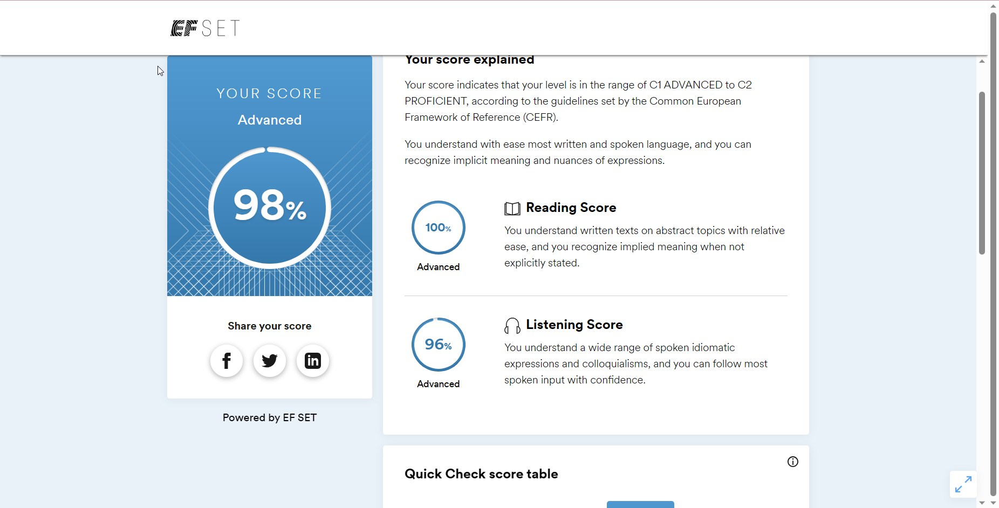
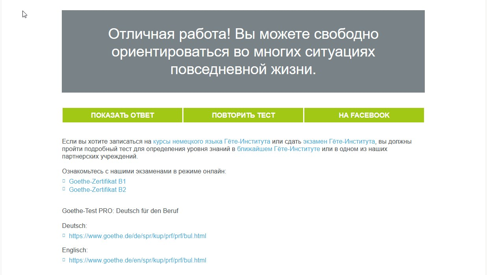

# CV - Ilona Eruzhava 

## Quality Assurance Engineer
#### *Manual Functional testing*
---
### **Contacts:**
#### *Location:* Minsk, Belarus
#### *Phone:* +375-29-614-13-75
#### *Email:* i.eruzhava@gmail.com
#### *Github:* https://github.com/Ilonaeruzhava
---
### **Skills:**
* Planning the process of testing
* Performing tests (Front-end, Back-end)
* Creating documentation: Checklists, Test-cases, Test-suits, Bug Reports 
* DB testing (noSQL)

### **Tools:**
* ClickUp, Trello, Jira, Bugzilla
* Qase, Confluence, Google sheets, Excel
* Devtools
* Swagger 
* Postman, Fiddler
* Figma (Pixel Perfect)
* Pairwise composing tool/creation of different files
* BrowserStack
* VirtualBox
* MongoDB, MySQL

### **Technical knowledge:**
* Networking
* SDLC/STLC
* Techniques of test design
* Client-server Architecture 
* HTML, CSS, basics of JS
* DB (SQL, noSQL)
* Git
---
### **Experience**
#### **Technical Support**
Yandex *July 2023*

Resolving tecnhical issues of customers.
#### **QA engineer**
Educational Platform *January - May 2023*

Responsible for creating a test plan. Performing different types of tests (regression, integration, smoke). Locating the bug and reporting it using BTS. 


#### **Specilist in importing data**
Unum *July - Decemberr 2022*

Working with Big Data. Using the CRM system to import data. 

#### **QA intern**
A1QA *February - July 2022* 
Working on different projects. Using different tools to perform tasks. 

---
### **Code Example**
Программа, которая принимает с клавиатуры 2 пары целых ненулевых чисел, первая пара - числитель и знаменатель одной дроби: вторая пара - числитель и знаменатель другой дроби. Программа проверяет равны ли эти дроби друг другу и выводит на экран соответсвующее текстовое сообщение
```
*let FirstChislitel =+prompt("First Chislitel", "");
let FirstZnamenatel=+prompt("First znamenatel", "");
let SecondChislitel=+prompt("Second Chislitel", "");
let SecondZnamenatel=+prompt("Second znamenatel","");

if (FirstZnamenatel===0 || SecondZnamenatel===0){
  alert("mistake");
}

else if (FirstChislitel/FirstZnamenatel==SecondChislitel/SecondZnamenatel){
  alert("equal");
}

else{
  alert("not equal");
}*
```
---
### **About me**
---
### **Education**
*Belarusian State University* 2008-2011

International Relations/World Economy

---
### **Languages**
1 Russian - native

2 English - C1-C2

3 German A2-B1

4 Spanish A2